# 📊 인증 플로우 다이어그램

## 📋 목차
1. [전체 인증 시스템 아키텍처](#전체-인증-시스템-아키텍처)
2. [회원가입 플로우](#회원가입-플로우)
3. [로그인 플로우](#로그인-플로우)
4. [OAuth 인증 플로우](#oauth-인증-플로우)
5. [토큰 관리 플로우](#토큰-관리-플로우)
6. [에러 처리 플로우](#에러-처리-플로우)
7. [권한 확인 플로우](#권한-확인-플로우)

---

## 🏗️ 전체 인증 시스템 아키텍처

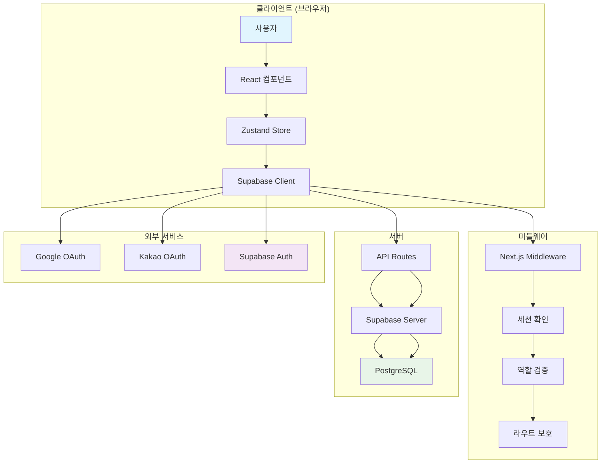
```mermaid
graph TB
    subgraph "클라이언트 (브라우저)"
        A[사용자] --> B[React 컴포넌트]
        B --> C[Zustand Store]
        C --> D[Supabase Client]
    end

    subgraph "미들웨어"
        E[Next.js Middleware]
        E --> F[세션 확인]
        F --> G[역할 검증]
        G --> H[라우트 보호]
    end

    subgraph "서버"
        I[API Routes]
        I --> J[Supabase Server]
        J --> K[PostgreSQL]
    end

    subgraph "외부 서비스"
        L[Google OAuth]
        M[Kakao OAuth]
        N[Supabase Auth]
    end

    D --> E
    D --> I
    D --> N
    I --> J
    J --> K
    D --> L
    D --> M

    style A fill:#e1f5fe
    style N fill:#f3e5f5
    style K fill:#e8f5e8
```

---

## 📝 회원가입 플로우

### 이메일 회원가입 플로우

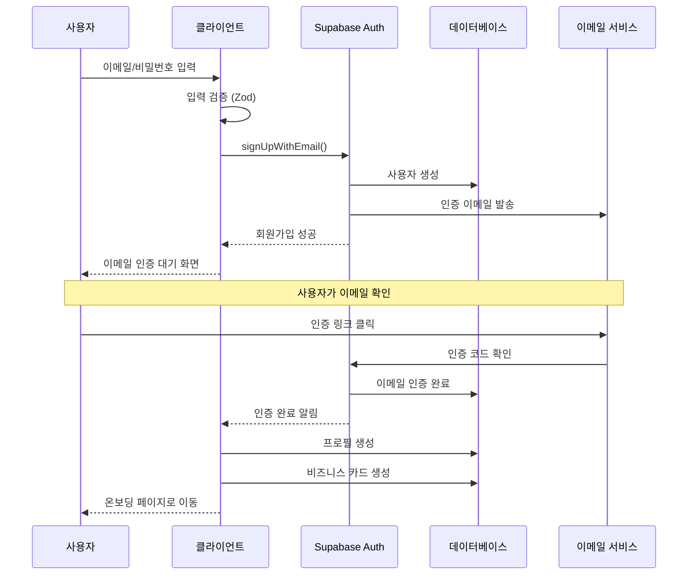
```mermaid
sequenceDiagram
    participant U as 사용자
    participant C as 클라이언트
    participant S as Supabase Auth
    participant DB as 데이터베이스
    participant E as 이메일 서비스

    U->>C: 이메일/비밀번호 입력
    C->>C: 입력 검증 (Zod)
    C->>S: signUpWithEmail()
    S->>DB: 사용자 생성
    S->>E: 인증 이메일 발송
    S-->>C: 회원가입 성공
    C-->>U: 이메일 인증 대기 화면

    Note over U,E: 사용자가 이메일 확인

    U->>E: 인증 링크 클릭
    E->>S: 인증 코드 확인
    S->>DB: 이메일 인증 완료
    S-->>C: 인증 완료 알림
    C->>DB: 프로필 생성
    C->>DB: 비즈니스 카드 생성
    C-->>U: 온보딩 페이지로 이동
```

### 소셜 회원가입 플로우

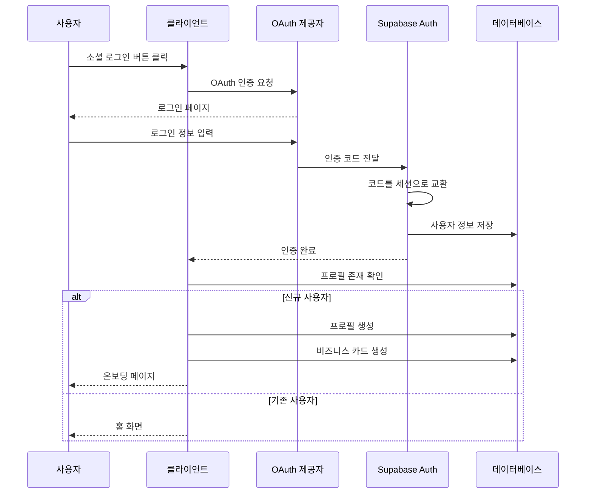
```mermaid
sequenceDiagram
    participant U as 사용자
    participant C as 클라이언트
    participant O as OAuth 제공자
    participant S as Supabase Auth
    participant DB as 데이터베이스

    U->>C: 소셜 로그인 버튼 클릭
    C->>O: OAuth 인증 요청
    O-->>U: 로그인 페이지
    U->>O: 로그인 정보 입력
    O->>S: 인증 코드 전달
    S->>S: 코드를 세션으로 교환
    S->>DB: 사용자 정보 저장
    S-->>C: 인증 완료

    C->>DB: 프로필 존재 확인
    alt 신규 사용자
        C->>DB: 프로필 생성
        C->>DB: 비즈니스 카드 생성
        C-->>U: 온보딩 페이지
    else 기존 사용자
        C-->>U: 홈 화면
    end
```

---

## 🔐 로그인 플로우

### 이메일 로그인 플로우

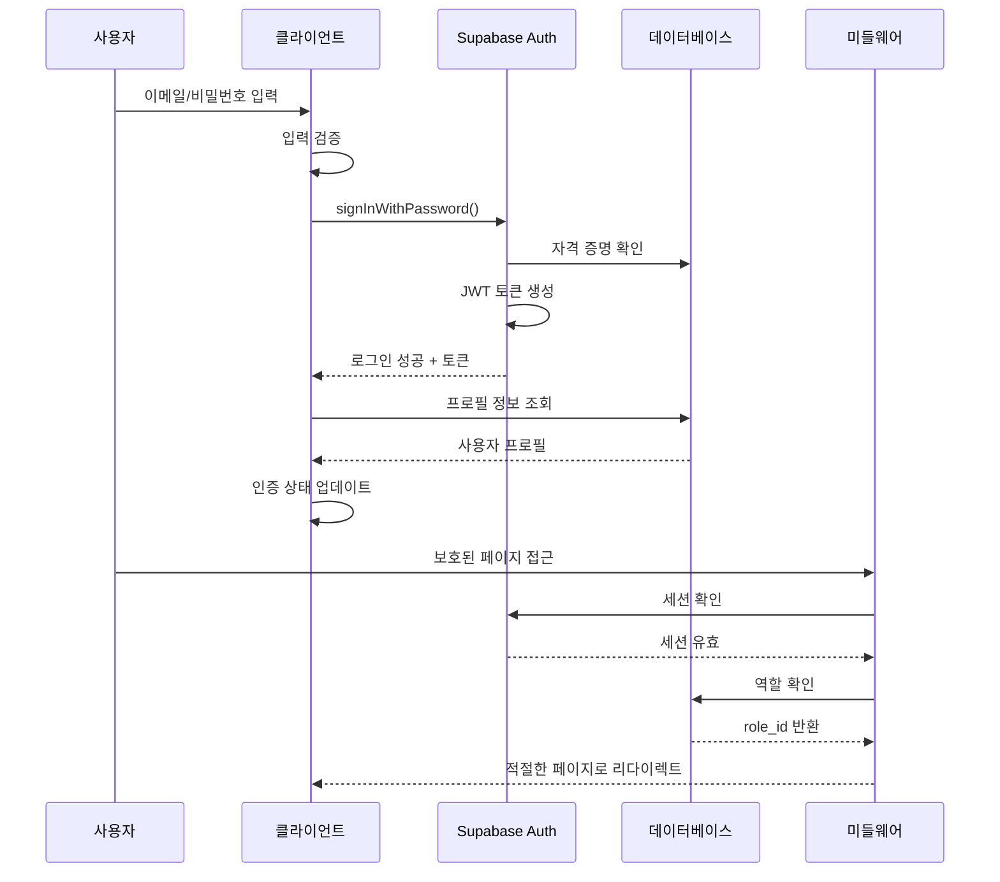
```mermaid
sequenceDiagram
    participant U as 사용자
    participant C as 클라이언트
    participant S as Supabase Auth
    participant DB as 데이터베이스
    participant M as 미들웨어

    U->>C: 이메일/비밀번호 입력
    C->>C: 입력 검증
    C->>S: signInWithPassword()
    S->>DB: 자격 증명 확인
    S->>S: JWT 토큰 생성
    S-->>C: 로그인 성공 + 토큰

    C->>DB: 프로필 정보 조회
    DB-->>C: 사용자 프로필
    C->>C: 인증 상태 업데이트

    U->>M: 보호된 페이지 접근
    M->>S: 세션 확인
    S-->>M: 세션 유효
    M->>DB: 역할 확인
    DB-->>M: role_id 반환
    M-->>C: 적절한 페이지로 리다이렉트
```

### 소셜 로그인 플로우

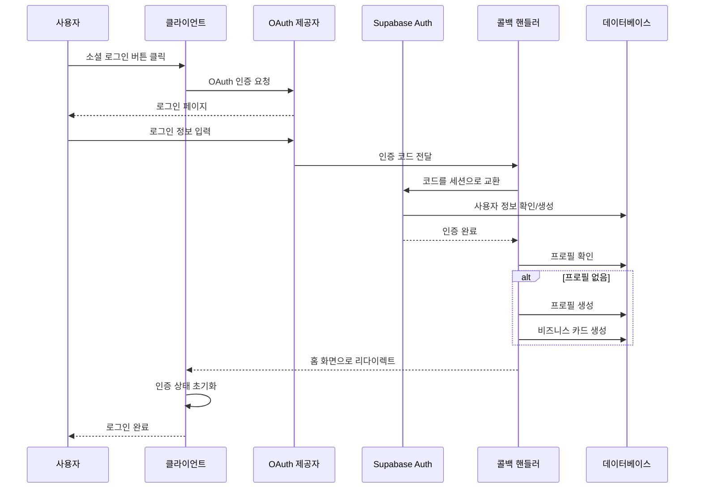
```mermaid
sequenceDiagram
    participant U as 사용자
    participant C as 클라이언트
    participant O as OAuth 제공자
    participant S as Supabase Auth
    participant CB as 콜백 핸들러
    participant DB as 데이터베이스

    U->>C: 소셜 로그인 버튼 클릭
    C->>O: OAuth 인증 요청
    O-->>U: 로그인 페이지
    U->>O: 로그인 정보 입력
    O->>CB: 인증 코드 전달
    CB->>S: 코드를 세션으로 교환
    S->>DB: 사용자 정보 확인/생성
    S-->>CB: 인증 완료

    CB->>DB: 프로필 확인
    alt 프로필 없음
        CB->>DB: 프로필 생성
        CB->>DB: 비즈니스 카드 생성
    end

    CB-->>C: 홈 화면으로 리다이렉트
    C->>C: 인증 상태 초기화
    C-->>U: 로그인 완료
```

---

## 🔄 OAuth 인증 플로우

### Google OAuth 상세 플로우

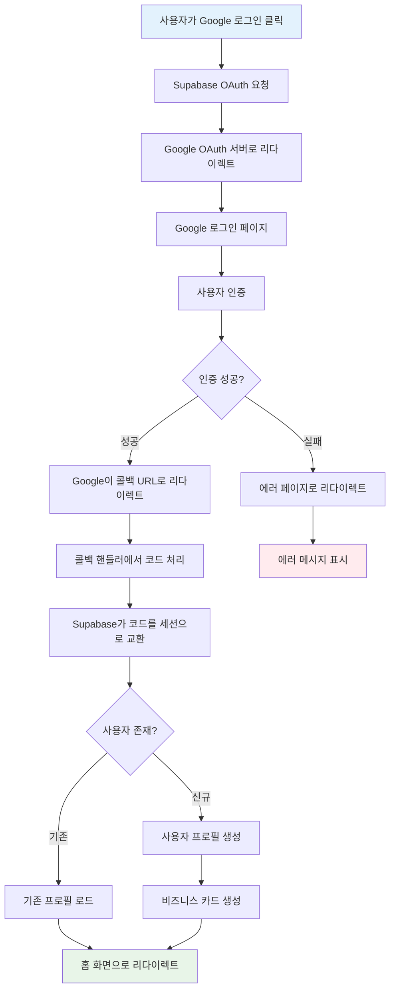
```mermaid
graph TD
    A[사용자가 Google 로그인 클릭] --> B[Supabase OAuth 요청]
    B --> C[Google OAuth 서버로 리다이렉트]
    C --> D[Google 로그인 페이지]
    D --> E[사용자 인증]
    E --> F{인증 성공?}

    F -->|성공| G[Google이 콜백 URL로 리다이렉트]
    F -->|실패| H[에러 페이지로 리다이렉트]

    G --> I[콜백 핸들러에서 코드 처리]
    I --> J[Supabase가 코드를 세션으로 교환]
    J --> K{사용자 존재?}

    K -->|신규| L[사용자 프로필 생성]
    K -->|기존| M[기존 프로필 로드]

    L --> N[비즈니스 카드 생성]
    M --> O[홈 화면으로 리다이렉트]
    N --> O

    H --> P[에러 메시지 표시]

    style A fill:#e3f2fd
    style O fill:#e8f5e8
    style P fill:#ffebee
```

### OAuth 콜백 처리 플로우

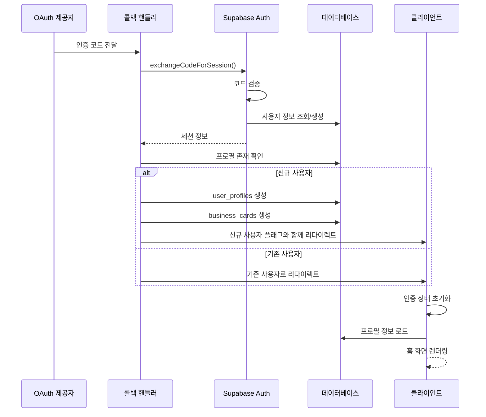
```mermaid
sequenceDiagram
    participant O as OAuth 제공자
    participant CB as 콜백 핸들러
    participant S as Supabase Auth
    participant DB as 데이터베이스
    participant C as 클라이언트

    O->>CB: 인증 코드 전달
    CB->>S: exchangeCodeForSession()
    S->>S: 코드 검증
    S->>DB: 사용자 정보 조회/생성
    S-->>CB: 세션 정보

    CB->>DB: 프로필 존재 확인
    alt 신규 사용자
        CB->>DB: user_profiles 생성
        CB->>DB: business_cards 생성
        CB->>C: 신규 사용자 플래그와 함께 리다이렉트
    else 기존 사용자
        CB->>C: 기존 사용자로 리다이렉트
    end

    C->>C: 인증 상태 초기화
    C->>DB: 프로필 정보 로드
    C-->>C: 홈 화면 렌더링
```

---

## 🔑 토큰 관리 플로우

### 토큰 생명주기

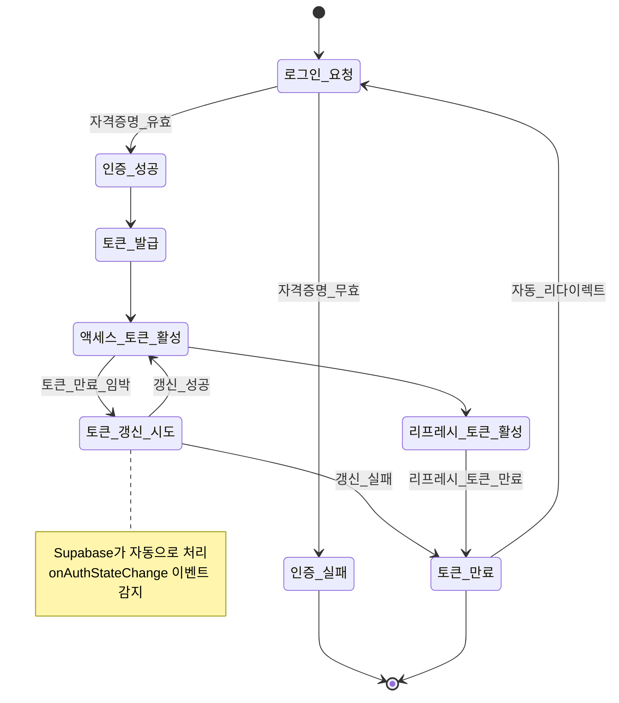
```mermaid
stateDiagram-v2
    [*] --> 로그인_요청
    로그인_요청 --> 인증_성공: 자격증명_유효
    로그인_요청 --> 인증_실패: 자격증명_무효

    인증_성공 --> 토큰_발급
    토큰_발급 --> 액세스_토큰_활성
    액세스_토큰_활성 --> 리프레시_토큰_활성

    액세스_토큰_활성 --> 토큰_갱신_시도: 토큰_만료_임박
    토큰_갱신_시도 --> 액세스_토큰_활성: 갱신_성공
    토큰_갱신_시도 --> 토큰_만료: 갱신_실패

    토큰_만료 --> 로그인_요청: 자동_리다이렉트
    리프레시_토큰_활성 --> 토큰_만료: 리프레시_토큰_만료

    인증_실패 --> [*]
    토큰_만료 --> [*]

    note right of 토큰_갱신_시도
        Supabase가 자동으로 처리
        onAuthStateChange 이벤트 감지
    end note
```

### 토큰 갱신 플로우

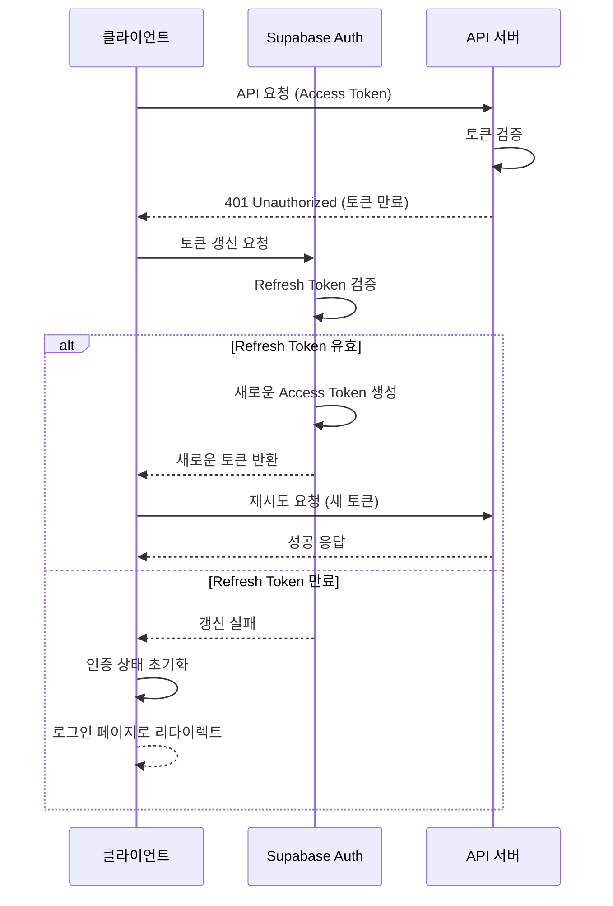
```mermaid
sequenceDiagram
    participant C as 클라이언트
    participant S as Supabase Auth
    participant API as API 서버

    C->>API: API 요청 (Access Token)
    API->>API: 토큰 검증
    API-->>C: 401 Unauthorized (토큰 만료)

    C->>S: 토큰 갱신 요청
    S->>S: Refresh Token 검증
    alt Refresh Token 유효
        S->>S: 새로운 Access Token 생성
        S-->>C: 새로운 토큰 반환
        C->>API: 재시도 요청 (새 토큰)
        API-->>C: 성공 응답
    else Refresh Token 만료
        S-->>C: 갱신 실패
        C->>C: 인증 상태 초기화
        C-->>C: 로그인 페이지로 리다이렉트
    end
```

---

## ⚠️ 에러 처리 플로우

### 토큰 만료 에러 처리

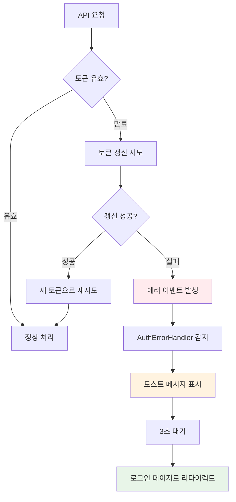
```mermaid
graph TD
    A[API 요청] --> B{토큰 유효?}
    B -->|유효| C[정상 처리]
    B -->|만료| D[토큰 갱신 시도]

    D --> E{갱신 성공?}
    E -->|성공| F[새 토큰으로 재시도]
    E -->|실패| G[에러 이벤트 발생]

    G --> H[AuthErrorHandler 감지]
    H --> I[토스트 메시지 표시]
    I --> J[3초 대기]
    J --> K[로그인 페이지로 리다이렉트]

    F --> C

    style G fill:#ffebee
    style I fill:#fff3e0
    style K fill:#e8f5e8
```

### OAuth 에러 처리

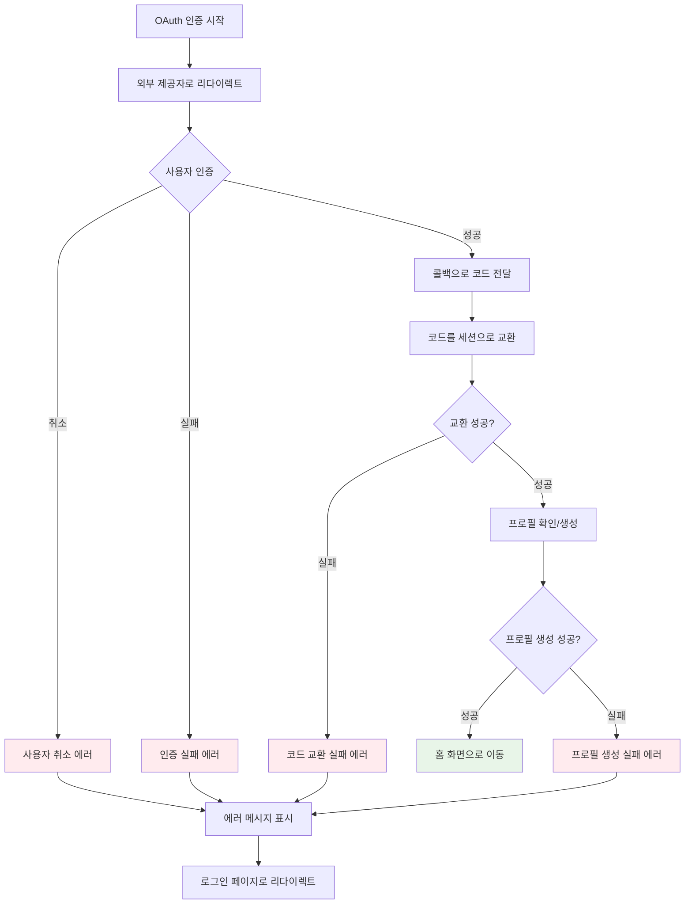
```mermaid
graph TD
    A[OAuth 인증 시작] --> B[외부 제공자로 리다이렉트]
    B --> C{사용자 인증}

    C -->|성공| D[콜백으로 코드 전달]
    C -->|취소| E[사용자 취소 에러]
    C -->|실패| F[인증 실패 에러]

    D --> G[코드를 세션으로 교환]
    G --> H{교환 성공?}

    H -->|성공| I[프로필 확인/생성]
    H -->|실패| J[코드 교환 실패 에러]

    I --> K{프로필 생성 성공?}
    K -->|성공| L[홈 화면으로 이동]
    K -->|실패| M[프로필 생성 실패 에러]

    E --> N[에러 메시지 표시]
    F --> N
    J --> N
    M --> N

    N --> O[로그인 페이지로 리다이렉트]

    style E fill:#ffebee
    style F fill:#ffebee
    style J fill:#ffebee
    style M fill:#ffebee
    style L fill:#e8f5e8
```

---

## 🛡️ 권한 확인 플로우

### 미들웨어 권한 검증

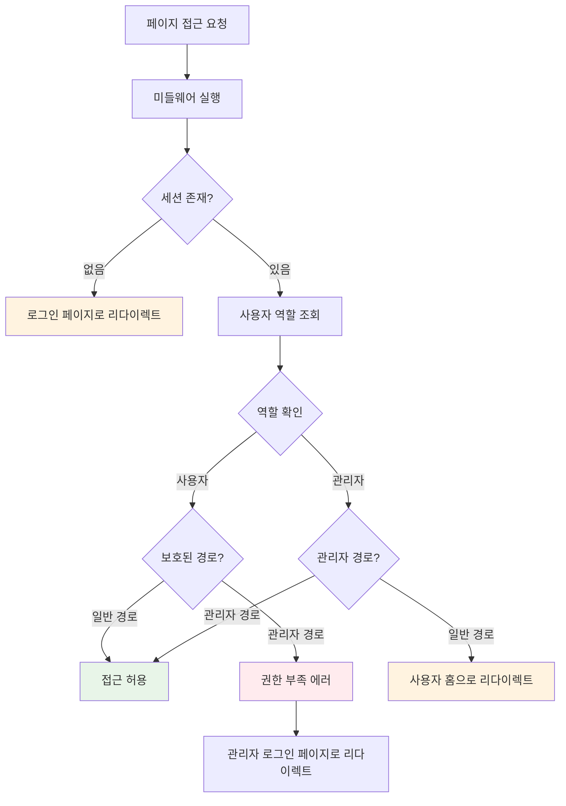
```mermaid
graph TD
    A[페이지 접근 요청] --> B[미들웨어 실행]
    B --> C{세션 존재?}

    C -->|없음| D[로그인 페이지로 리다이렉트]
    C -->|있음| E[사용자 역할 조회]

    E --> F{역할 확인}
    F -->|사용자| G{보호된 경로?}
    F -->|관리자| H{관리자 경로?}

    G -->|일반 경로| I[접근 허용]
    G -->|관리자 경로| J[권한 부족 에러]

    H -->|관리자 경로| I
    H -->|일반 경로| K[사용자 홈으로 리다이렉트]

    J --> L[관리자 로그인 페이지로 리다이렉트]

    style D fill:#fff3e0
    style J fill:#ffebee
    style K fill:#fff3e0
    style I fill:#e8f5e8
```

### API 권한 검증

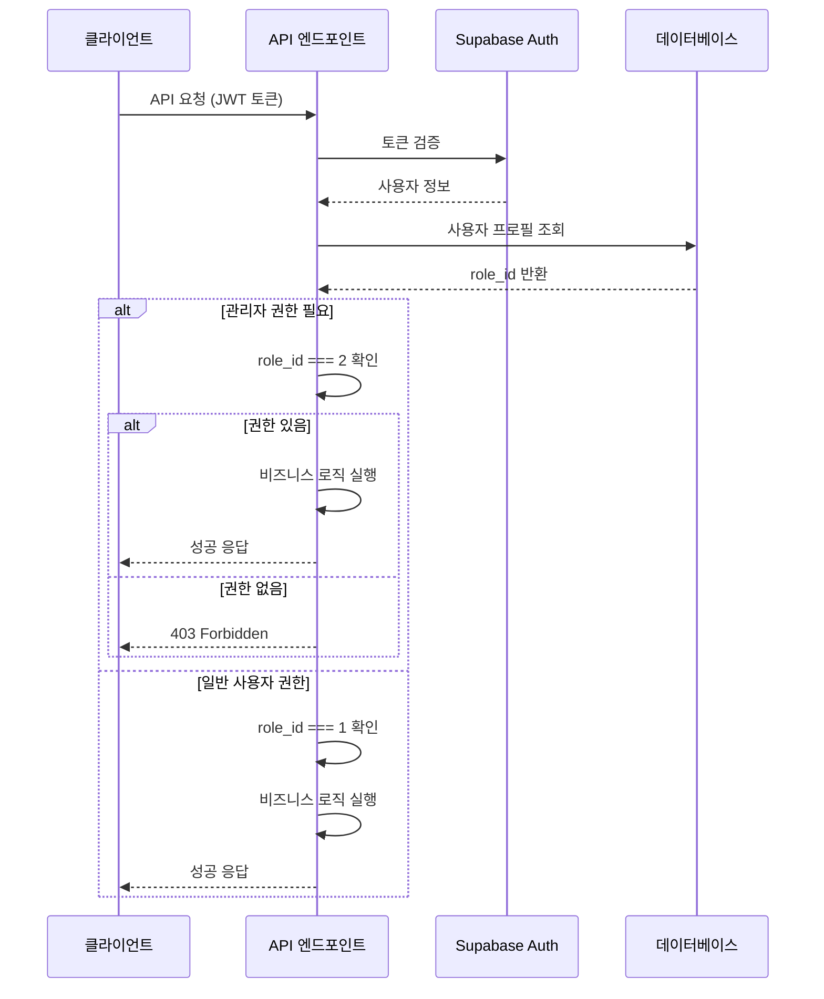
```mermaid
sequenceDiagram
    participant C as 클라이언트
    participant API as API 엔드포인트
    participant S as Supabase Auth
    participant DB as 데이터베이스

    C->>API: API 요청 (JWT 토큰)
    API->>S: 토큰 검증
    S-->>API: 사용자 정보

    API->>DB: 사용자 프로필 조회
    DB-->>API: role_id 반환

    alt 관리자 권한 필요
        API->>API: role_id === 2 확인
        alt 권한 있음
            API->>API: 비즈니스 로직 실행
            API-->>C: 성공 응답
        else 권한 없음
            API-->>C: 403 Forbidden
        end
    else 일반 사용자 권한
        API->>API: role_id === 1 확인
        API->>API: 비즈니스 로직 실행
        API-->>C: 성공 응답
    end
```

---

## 🔄 상태 관리 플로우

### 인증 상태 동기화

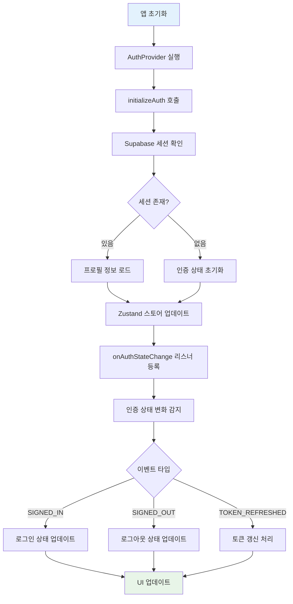
```mermaid
graph TD
    A[앱 초기화] --> B[AuthProvider 실행]
    B --> C[initializeAuth 호출]
    C --> D[Supabase 세션 확인]

    D --> E{세션 존재?}
    E -->|있음| F[프로필 정보 로드]
    E -->|없음| G[인증 상태 초기화]

    F --> H[Zustand 스토어 업데이트]
    G --> H

    H --> I[onAuthStateChange 리스너 등록]
    I --> J[인증 상태 변화 감지]

    J --> K{이벤트 타입}
    K -->|SIGNED_IN| L[로그인 상태 업데이트]
    K -->|SIGNED_OUT| M[로그아웃 상태 업데이트]
    K -->|TOKEN_REFRESHED| N[토큰 갱신 처리]

    L --> O[UI 업데이트]
    M --> O
    N --> O

    style A fill:#e3f2fd
    style O fill:#e8f5e8
```

---

## 📱 사용자 경험 플로우

### 신규 사용자 온보딩

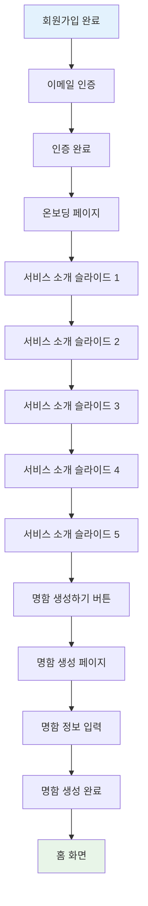
```mermaid
graph TD
    A[회원가입 완료] --> B[이메일 인증]
    B --> C[인증 완료]
    C --> D[온보딩 페이지]

    D --> E[서비스 소개 슬라이드 1]
    E --> F[서비스 소개 슬라이드 2]
    F --> G[서비스 소개 슬라이드 3]
    G --> H[서비스 소개 슬라이드 4]
    H --> I[서비스 소개 슬라이드 5]

    I --> J[명함 생성하기 버튼]
    J --> K[명함 생성 페이지]
    K --> L[명함 정보 입력]
    L --> M[명함 생성 완료]
    M --> N[홈 화면]

    style A fill:#e3f2fd
    style N fill:#e8f5e8
```

### 기존 사용자 로그인

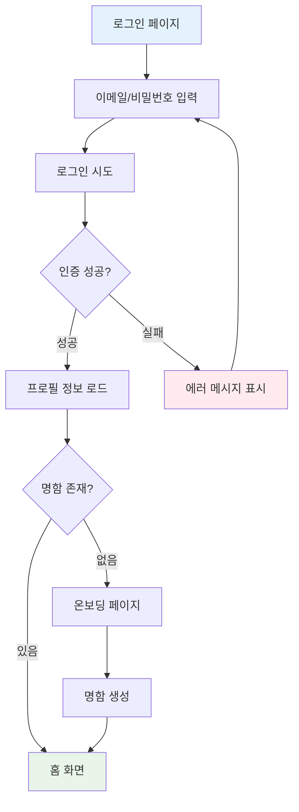
```mermaid
graph TD
    A[로그인 페이지] --> B[이메일/비밀번호 입력]
    B --> C[로그인 시도]
    C --> D{인증 성공?}

    D -->|성공| E[프로필 정보 로드]
    D -->|실패| F[에러 메시지 표시]

    E --> G{명함 존재?}
    G -->|있음| H[홈 화면]
    G -->|없음| I[온보딩 페이지]

    F --> B
    I --> J[명함 생성]
    J --> H

    style A fill:#e3f2fd
    style H fill:#e8f5e8
    style F fill:#ffebee
```

---

## 🔧 디버깅 플로우

### 에러 추적 및 로깅

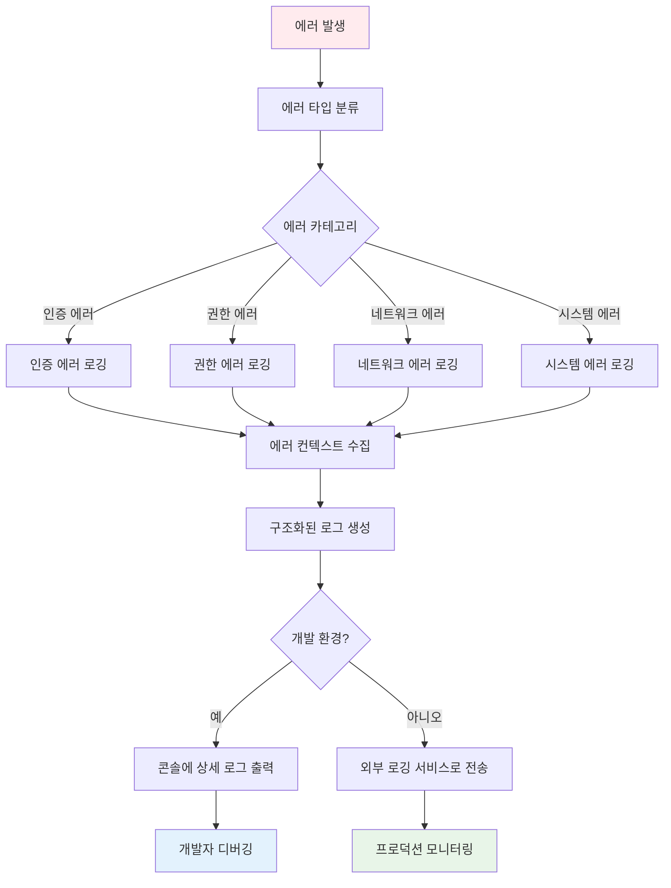
```mermaid
graph TD
    A[에러 발생] --> B[에러 타입 분류]
    B --> C{에러 카테고리}

    C -->|인증 에러| D[인증 에러 로깅]
    C -->|권한 에러| E[권한 에러 로깅]
    C -->|네트워크 에러| F[네트워크 에러 로깅]
    C -->|시스템 에러| G[시스템 에러 로깅]

    D --> H[에러 컨텍스트 수집]
    E --> H
    F --> H
    G --> H

    H --> I[구조화된 로그 생성]
    I --> J{개발 환경?}

    J -->|예| K[콘솔에 상세 로그 출력]
    J -->|아니오| L[외부 로깅 서비스로 전송]

    K --> M[개발자 디버깅]
    L --> N[프로덕션 모니터링]

    style A fill:#ffebee
    style M fill:#e3f2fd
    style N fill:#e8f5e8
```

---

## 📊 성능 모니터링 플로우

### 인증 성능 측정

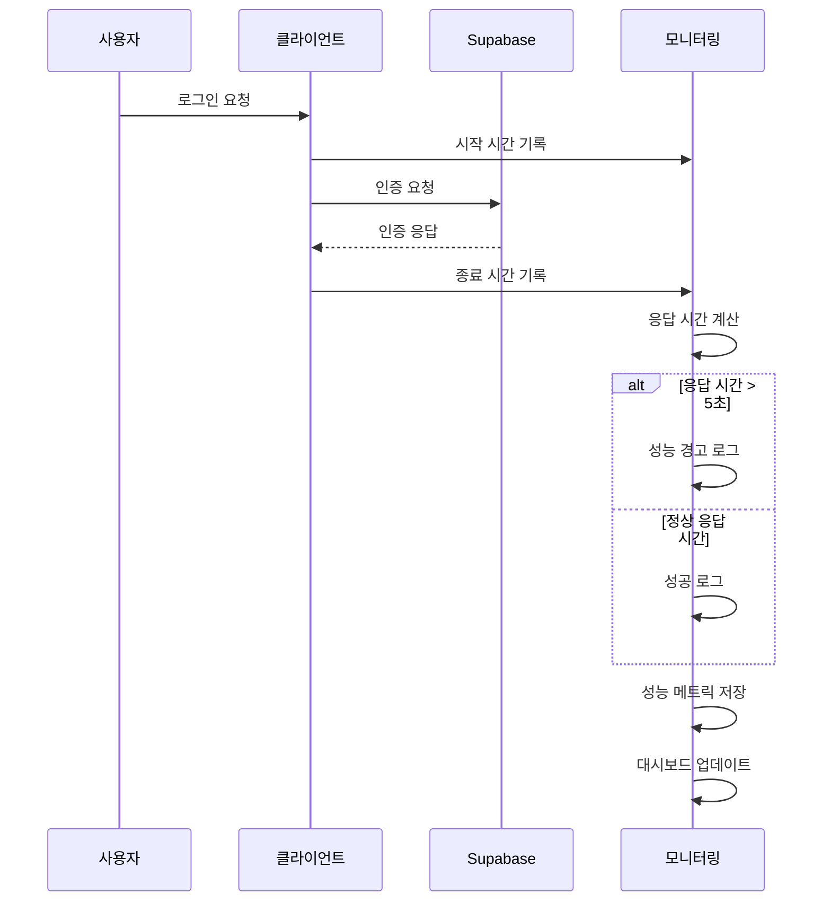
```mermaid
sequenceDiagram
    participant U as 사용자
    participant C as 클라이언트
    participant S as Supabase
    participant M as 모니터링

    U->>C: 로그인 요청
    C->>M: 시작 시간 기록
    C->>S: 인증 요청
    S-->>C: 인증 응답
    C->>M: 종료 시간 기록
    M->>M: 응답 시간 계산

    alt 응답 시간 > 5초
        M->>M: 성능 경고 로그
    else 정상 응답 시간
        M->>M: 성공 로그
    end

    M->>M: 성능 메트릭 저장
    M->>M: 대시보드 업데이트
```

---

## 📚 추가 리소스

### 관련 문서
- [인증 시스템 전체 가이드](./AUTH_SYSTEM_OVERVIEW.md)
- [에러 처리 가이드](./AUTH_ERROR_HANDLING.md)
- [SNS 로그인 설정 가이드](./SNS_LOGIN_SETUP.md)

### 다이어그램 도구
- [Mermaid Live Editor](https://mermaid.live/)
- [Draw.io](https://app.diagrams.net/)
- [Lucidchart](https://www.lucidchart.com/)

---

*이 문서는 Neimd 인증 시스템의 모든 플로우를 시각적으로 표현합니다. 각 다이어그램은 실제 구현과 일치하며, 개발 및 디버깅 시 참고할 수 있습니다.*
