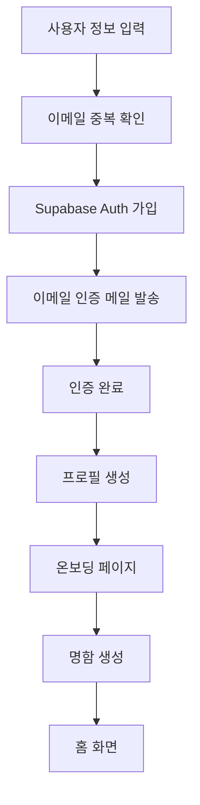
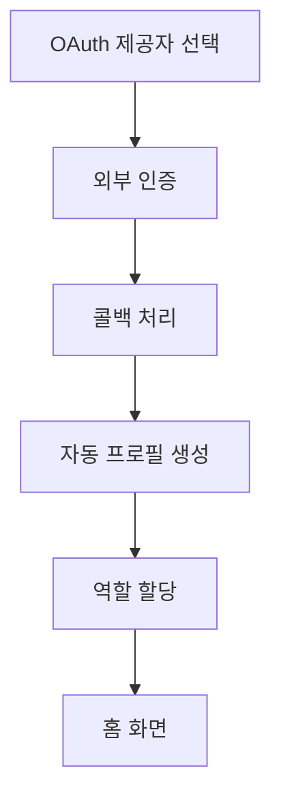
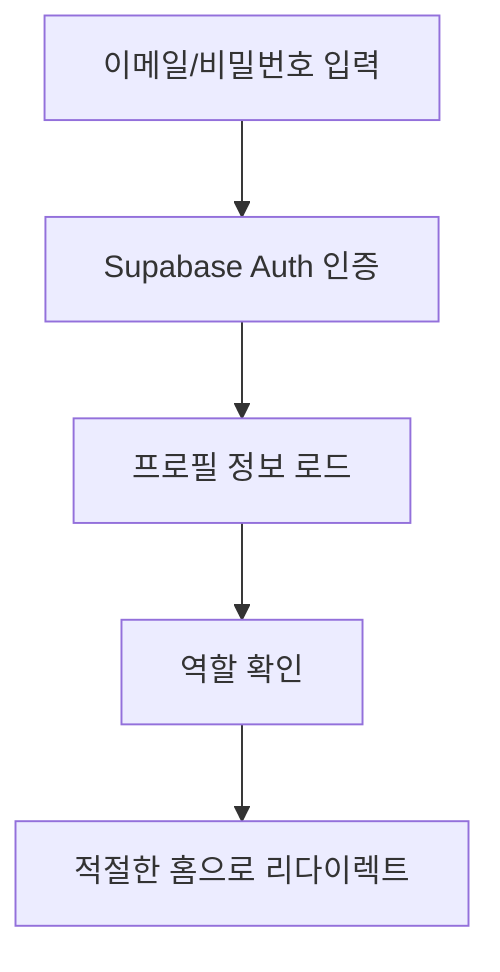
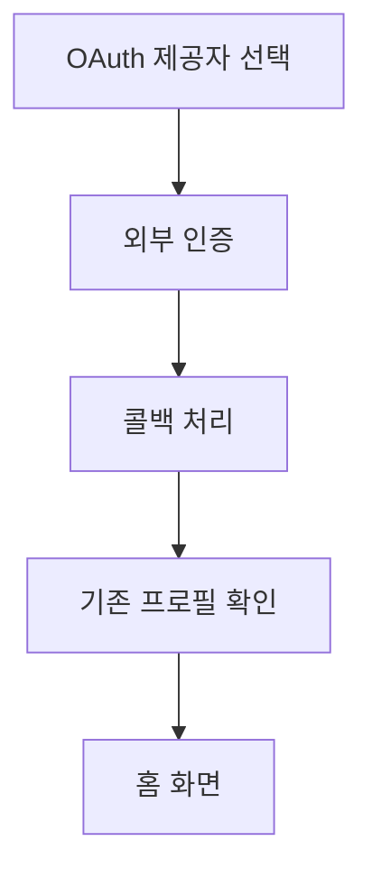
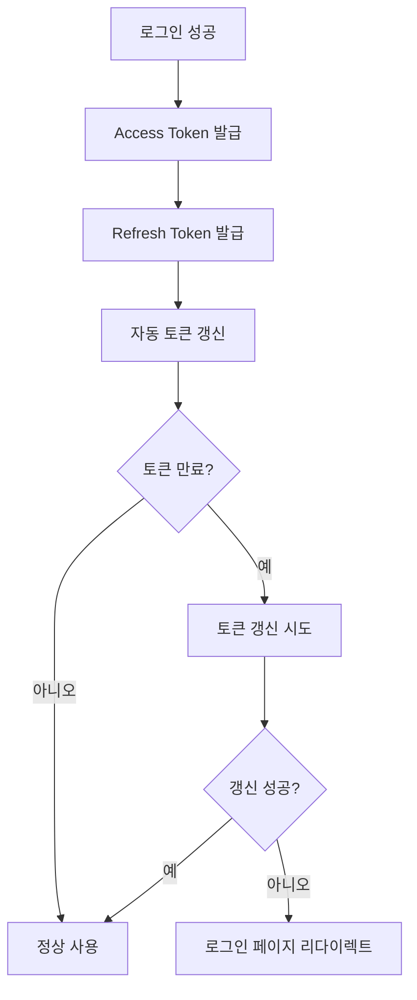

# 🔐 ndrop 인증 시스템 전체 가이드

## 📋 목차
1. [시스템 아키텍처](#시스템-아키텍처)
2. [인증 플로우](#인증-플로우)
3. [컴포넌트 구조](#컴포넌트-구조)
4. [보안 및 권한 관리](#보안-및-권한-관리)
5. [에러 처리](#에러-처리)
6. [API 엔드포인트](#api-엔드포인트)
7. [디버깅 가이드](#디버깅-가이드)

---

## 🏗️ 시스템 아키텍처

### 핵심 구조
ndrop는 **이중 인증 시스템**을 구현하여 사용자와 관리자를 완전히 분리합니다.

```
┌─────────────────┐    ┌─────────────────┐
│   일반 사용자    │    │     관리자      │
│  (role_id: 1)   │    │  (role_id: 2)   │
└─────────────────┘    └─────────────────┘
         │                       │
         └───────────┬───────────┘
                     │
            ┌─────────────────┐
            │  Supabase Auth  │
            │  (JWT 토큰)     │
            └─────────────────┘
                     │
            ┌─────────────────┐
            │   미들웨어      │
            │ (라우트 보호)   │
            └─────────────────┘
```

### 기술 스택
- **인증**: Supabase Auth (JWT 토큰)
- **상태 관리**: Zustand + Persist
- **라우트 보호**: Next.js Middleware
- **소셜 로그인**: Google, Kakao OAuth
- **데이터베이스**: PostgreSQL + RLS

---

## 🔄 인증 플로우

### 1. 회원가입 플로우

#### 이메일 회원가입


#### 소셜 회원가입


### 2. 로그인 플로우

#### 이메일 로그인


#### 소셜 로그인


### 3. 토큰 관리 플로우



---

## 🧩 컴포넌트 구조

### 1. 미들웨어 (`middleware.ts`)

**핵심 기능:**
- 세션 확인 및 역할 검증
- 보호된 경로 접근 제어
- 사용자/관리자 자동 리다이렉트

**경로 분류:**
```typescript
const protectedRoutes = ['/client', '/home', '/my-page', '/events', ...]
const authRoutes = ['/login', '/signup', '/verify', ...]
const adminRoutes = ['/admin']
const adminAuthRoutes = ['/admin/login', '/admin/signup']
```

**접근 제어 로직:**
```typescript
// 1. 루트 경로 처리
if (req.nextUrl.pathname === '/') {
  if (!session) return redirect('/login?type=user')
  if (userRole === 2) return redirect('/admin/dashboard')
  return redirect('/client/home')
}

// 2. Admin 경로 접근 제어
if (isAdminRoute && !isAdminAuthRoute) {
  if (!session || userRole !== 2) {
    return redirect('/admin/login')
  }
}

// 3. 보호된 경로 접근 제어
if (isProtectedRoute && !session) {
  return redirect('/login')
}
```

### 2. 인증 스토어 (`stores/auth-store.ts`)

**상태 구조:**
```typescript
interface AuthState {
  // 사용자 인증
  user: User | null
  userSession: Session | null
  userProfile: UserProfile | null
  userLoading: boolean
  userInitialized: boolean

  // 관리자 인증
  admin: User | null
  adminSession: Session | null
  adminProfile: AdminProfile | null
  adminLoading: boolean
  adminInitialized: boolean
}
```

**주요 메서드:**
```typescript
// 인증 메서드
signInWithEmail(email, password, type)
signUpWithEmail(email, password, name?, type?)
signInWithOAuth(provider, type, returnTo?)
signOut(type)

// 프로필 메서드
fetchUserProfile(userId)
fetchAdminProfile(userId)

// 유틸리티 메서드
initializeAuth(type?)
handleTokenExpired()
clearAuthCache()
```

### 3. OAuth 콜백 처리

#### 서버 사이드 (`app/(auth)/callback/route.ts`)
```typescript
export async function GET(request: NextRequest) {
  const { searchParams } = new URL(request.url)
  const code = searchParams.get('code')

  if (code) {
    const { data, error } = await supabase.auth.exchangeCodeForSession(code)

    if (!error && data.user) {
      // 신규 사용자 프로필 생성
      const existingProfile = await userProfileAPI.getUserProfile(data.user.id)

      if (!existingProfile) {
        const userRole = isAdminEmail(data.user.email) ? 'admin' : 'user'

        // 프로필 및 비즈니스 카드 자동 생성
        await userProfileAPI.createUserProfile({...})
        await businessCardAPI.createBusinessCard({...})
      }
    }
  }
}
```

#### 클라이언트 사이드 (`app/auth/callback/page.tsx`)
```typescript
useEffect(() => {
  const handleAuthCallback = async () => {
    const { data, error } = await supabase.auth.getSession()

    if (error) {
      setError(error.message)
      toast.error('로그인 처리 중 오류가 발생했습니다.')
      return
    }

    if (data.session && data.session.user) {
      // 프로필 확인 및 생성
      const { data: profile } = await supabase
        .from('user_profiles')
        .select('*')
        .eq('id', data.session.user.id)
        .single()

      if (!profile) {
        // API를 통한 프로필 생성
        await fetch('/api/auth/oauth-profile', {
          method: 'POST',
          headers: { 'Content-Type': 'application/json' },
          body: JSON.stringify({ userId: data.session.user.id })
        })
      }

      // 역할 기반 리다이렉트
      const returnTo = getReturnToPath()
      router.push(returnTo)
    }
  }

  handleAuthCallback()
}, [])
```

---

## 🛡️ 보안 및 권한 관리

### 1. 역할 기반 접근 제어 (RBAC)

**역할 정의:**
```typescript
const ROLE_IDS = {
  USER: 1,    // 일반 사용자
  ADMIN: 2    // 관리자
}

const ROLE_NAMES = {
  USER: 'user',
  ADMIN: 'admin'
}
```

**권한 확인 로직:**
```typescript
// 미들웨어에서 역할 확인
async function getUserRole(userId: string): Promise<number | null> {
  const { data: profile } = await supabase
    .from('user_profiles')
    .select('role_id')
    .eq('id', userId)
    .single()

  return profile?.role_id || null
}
```

### 2. 데이터베이스 보안 (RLS)

**Row Level Security 정책:**
```sql
-- user_profiles 테이블
CREATE POLICY "Users can view own profile" ON user_profiles
  FOR SELECT USING (auth.uid() = id);

CREATE POLICY "Users can update own profile" ON user_profiles
  FOR UPDATE USING (auth.uid() = id);

-- business_cards 테이블
CREATE POLICY "Users can view own cards" ON business_cards
  FOR SELECT USING (auth.uid() = user_id);

CREATE POLICY "Users can update own cards" ON business_cards
  FOR UPDATE USING (auth.uid() = user_id);
```

### 3. 입력 검증

**클라이언트 사이드:**
```typescript
// Zod 스키마 검증
const loginSchema = z.object({
  email: z.string().email('올바른 이메일 형식을 입력해주세요'),
  password: z.string().min(6, '비밀번호는 최소 6자 이상이어야 합니다')
})

// 실시간 검증
const emailRegex = /^[^\s@]+@[^\s@]+\.[^\s@]+$/
if (!emailRegex.test(email)) {
  return { error: { message: '올바른 이메일 형식을 입력해주세요.' } }
}
```

**서버 사이드:**
```typescript
// Supabase Auth 내장 검증
const { data, error } = await supabase.auth.signInWithPassword({
  email,
  password,
})

// API 엔드포인트 권한 확인
const { data: { user } } = await supabase.auth.getUser()
if (!user) {
  return NextResponse.json({ error: 'Unauthorized' }, { status: 401 })
}
```

---

## ⚠️ 에러 처리

### 1. 토큰 만료 에러 처리

**에러 감지:**
```typescript
// Supabase 클라이언트에서 에러 감지
client.auth.onAuthStateChange((event, session) => {
  if (event === 'TOKEN_REFRESHED' && !session) {
    console.warn('⚠️ 토큰 갱신 실패 - 리프레시 토큰이 유효하지 않습니다')

    // 전역 에러 이벤트 발생
    const error = new Error('Invalid Refresh Token: Refresh Token Not Found')
    const authErrorEvent = new CustomEvent('auth-error', { detail: error })
    window.dispatchEvent(authErrorEvent)
  }
})
```

**에러 처리 컴포넌트:**
```typescript
// AuthErrorHandler 컴포넌트
export default function AuthErrorHandler({ children }: AuthErrorHandlerProps) {
  const { handleTokenExpired } = useAuthStore()

  useEffect(() => {
    const handleAuthError = (event: CustomEvent) => {
      const error = event.detail

      if (error?.message?.includes('Invalid Refresh Token') ||
          error?.message?.includes('Refresh Token Not Found')) {

        // 사용자에게 친화적인 메시지 표시
        toast.error('세션이 만료되었습니다. 다시 로그인해주세요.', {
          duration: 5000,
          action: {
            label: '로그인',
            onClick: () => handleTokenExpired()
          }
        })

        // 3초 후 자동으로 로그인 페이지로 이동
        setTimeout(() => {
          handleTokenExpired()
        }, 3000)
      }
    }

    window.addEventListener('auth-error', handleAuthError as EventListener)
    return () => {
      window.removeEventListener('auth-error', handleAuthError as EventListener)
    }
  }, [handleTokenExpired])

  return <>{children}</>
}
```

### 2. 인증 에러 분류

**에러 타입별 처리:**
```typescript
// 로그인 에러 처리
switch (error.message) {
  case 'Invalid login credentials':
  case 'Invalid email or password':
    errorMessage = '이메일 또는 비밀번호가 올바르지 않습니다.'
    break
  case 'Email not confirmed':
    errorMessage = '이메일 인증이 완료되지 않았습니다. 이메일을 확인해주세요.'
    break
  case 'User not found':
    errorMessage = '가입되지 않은 이메일입니다. 회원가입을 먼저 진행해주세요.'
    break
  case 'Too many requests':
    errorMessage = '로그인 시도가 너무 많습니다. 잠시 후 다시 시도해주세요.'
    break
  default:
    if (error.message.includes('email')) {
      errorMessage = '올바른 이메일 형식을 입력해주세요.'
    } else if (error.message.includes('password')) {
      errorMessage = '비밀번호를 확인해주세요.'
    }
}
```

---

## 🔌 API 엔드포인트

### 1. 인증 관련 API

#### 프로필 생성 API
```typescript
// POST /api/auth/create-profile
export async function POST(request: NextRequest) {
  const { userId, email, name, roleId } = await request.json()

  // 역할 결정
  const finalRoleId = roleId || (isAdminEmail(email) ? ROLE_IDS.ADMIN : ROLE_IDS.USER)
  const userRole = finalRoleId === ROLE_IDS.ADMIN ? ROLE_NAMES.ADMIN : ROLE_NAMES.USER

  // 사용자 프로필 생성
  const { error: profileError } = await supabase
    .from('user_profiles')
    .insert({
      id: userId,
      full_name: name || '',
      email: email,
      role: userRole,
      role_id: finalRoleId,
      // ... 기타 필드
    })

  // 비즈니스 카드 생성
  const { error: cardError } = await supabase
    .from('business_cards')
    .insert({
      user_id: userId,
      full_name: name || '',
      email: email,
      // ... 기타 필드
    })

  return NextResponse.json({ success: true })
}
```

#### OAuth 프로필 처리 API
```typescript
// POST /api/auth/oauth-profile
export async function POST(request: NextRequest) {
  const { userId } = await request.json()

  // 사용자 정보 조회
  const { data: { user } } = await supabase.auth.admin.getUserById(userId)

  // 프로필 존재 여부 확인
  const { data: profile, error: profileError } = await supabase
    .from('user_profiles')
    .select('*')
    .eq('id', userId)
    .single()

  // 프로필이 없는 경우 생성
  if (profileError?.code === 'PGRST116') {
    const userMetadata = user.user_metadata || {}

    const profileData = {
      id: user.id,
      email: user.email || '',
      full_name: userMetadata.full_name || userMetadata.name || '',
      role_id: 1, // 일반 사용자
      profile_image_url: userMetadata.avatar_url || null,
      // ... 기타 필드
    }

    const { data: newProfile, error: createError } = await supabase
      .from('user_profiles')
      .insert(profileData)
      .select()
      .single()

    return NextResponse.json({
      success: true,
      profile: newProfile,
      isNewUser: true
    })
  }

  return NextResponse.json({
    success: true,
    profile: profile,
    isNewUser: false
  })
}
```

### 2. 사용자 관련 API

#### 온보딩 완료 API
```typescript
// POST /api/user/complete-onboarding
export async function POST(request: NextRequest) {
  const { userId } = await request.json()

  // 사용자 인증 확인
  const { data: { user } } = await supabase.auth.getUser()
  if (!user || user.id !== userId) {
    return NextResponse.json({ error: 'Unauthorized' }, { status: 401 })
  }

  // 온보딩 완료 상태 업데이트
  const { error } = await supabase
    .from('user_profiles')
    .update({ onboarding_completed: true })
    .eq('id', userId)

  if (error) {
    return NextResponse.json({ error: 'Failed to complete onboarding' }, { status: 500 })
  }

  return NextResponse.json({ success: true })
}
```

---

## 🐛 디버깅 가이드

### 1. 인증 플로우 디버깅

**로그 확인:**
```typescript
// 개발 환경에서 상세 로깅
if (process.env.NODE_ENV === 'development') {
  console.log('🔄 Middleware:', req.nextUrl.pathname)
  console.log('🔄 OAuth 콜백 처리 시작')
  console.log('✅ OAuth 로그인 성공:', data.session.user.email)
  console.log('📄 사용자 프로필 생성 중...')
}
```

**브라우저 개발자 도구:**
```javascript
// 콘솔에서 인증 상태 확인
console.log('Current user:', window.supabase.auth.getUser())
console.log('Current session:', window.supabase.auth.getSession())

// 인증 스토어 상태 확인
console.log('Auth store:', useAuthStore.getState())
```

### 2. 일반적인 문제 해결

#### 토큰 만료 에러
```typescript
// 문제: "Invalid Refresh Token: Refresh Token Not Found"
// 해결: AuthErrorHandler가 자동으로 처리
// 확인: 브라우저 개발자 도구에서 에러 이벤트 확인
```

#### OAuth 콜백 실패
```typescript
// 문제: OAuth 인증 후 콜백 처리 실패
// 해결:
// 1. 콜백 URL 설정 확인
// 2. 환경 변수 확인
// 3. Supabase 프로젝트 설정 확인
```

#### 권한 에러
```typescript
// 문제: "관리자 권한이 없습니다"
// 해결:
// 1. user_profiles 테이블의 role_id 확인
// 2. 미들웨어 로직 확인
// 3. 데이터베이스 RLS 정책 확인
```

### 3. 성능 모니터링

**인증 성능 메트릭:**
```typescript
// 로그인 시간 측정
const startTime = performance.now()
const { data, error } = await supabase.auth.signInWithPassword({
  email,
  password,
})
const endTime = performance.now()
console.log(`로그인 시간: ${endTime - startTime}ms`)

// 토큰 갱신 시간 측정
const refreshStartTime = performance.now()
// 토큰 갱신 로직
const refreshEndTime = performance.now()
console.log(`토큰 갱신 시간: ${refreshEndTime - refreshStartTime}ms`)
```

---

## 📚 추가 리소스

### 관련 문서
- [SNS 로그인 설정 가이드](./SNS_LOGIN_SETUP.md)
- [배포 가이드](./DEPLOYMENT.md)
- [실시간 알림 시스템](./SUPABASE_REALTIME_NOTIFICATIONS.md)

### 외부 링크
- [Supabase Auth 문서](https://supabase.com/docs/guides/auth)
- [Next.js Middleware 문서](https://nextjs.org/docs/app/building-your-application/routing/middleware)
- [Zustand 문서](https://zustand-demo.pmnd.rs/)

---

## 🔄 업데이트 이력

- **2024-01-XX**: 초기 문서 작성
- **2024-01-XX**: 토큰 만료 에러 처리 추가
- **2024-01-XX**: OAuth 콜백 처리 개선
- **2024-01-XX**: 에러 처리 시스템 강화

---

*이 문서는 ndrop 인증 시스템의 전체적인 구조와 동작 방식을 설명합니다. 추가 질문이나 개선 사항이 있으면 개발팀에 문의해주세요.*
